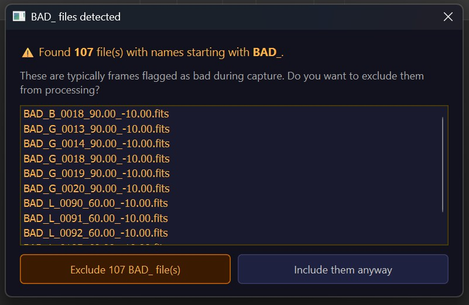
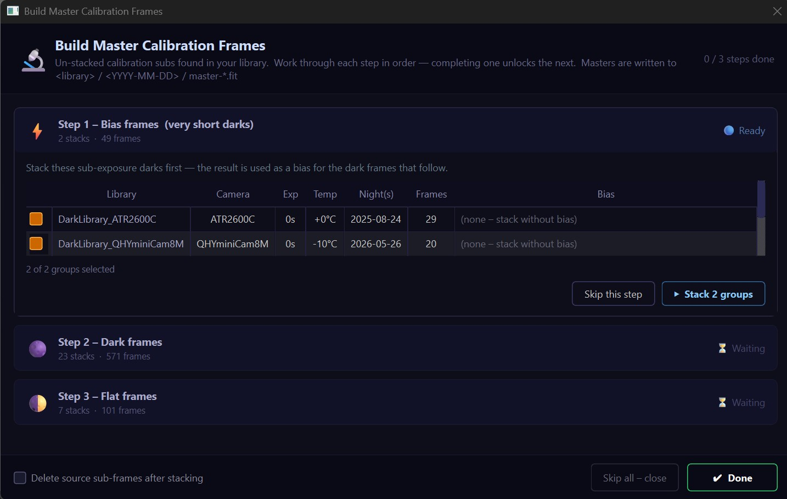
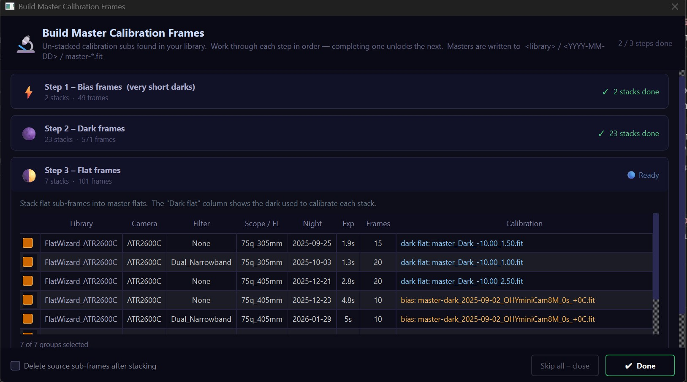
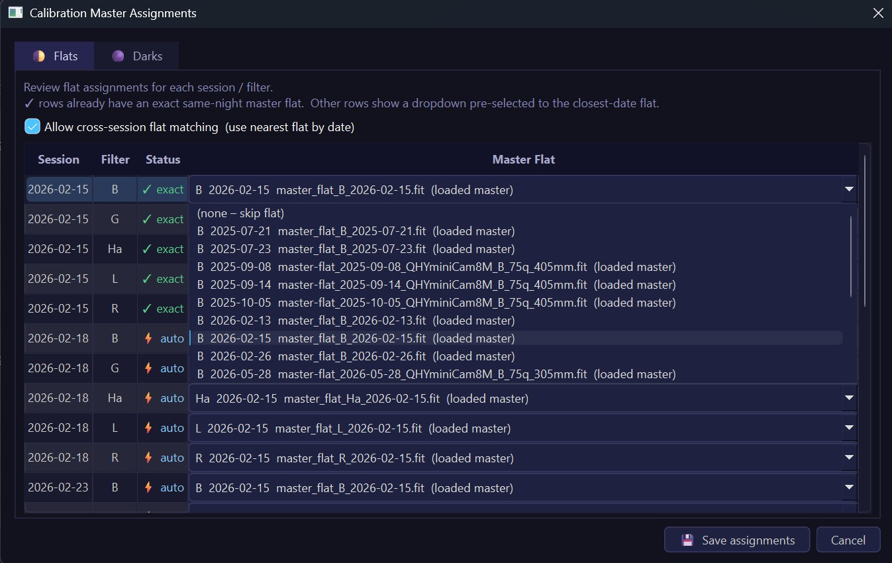
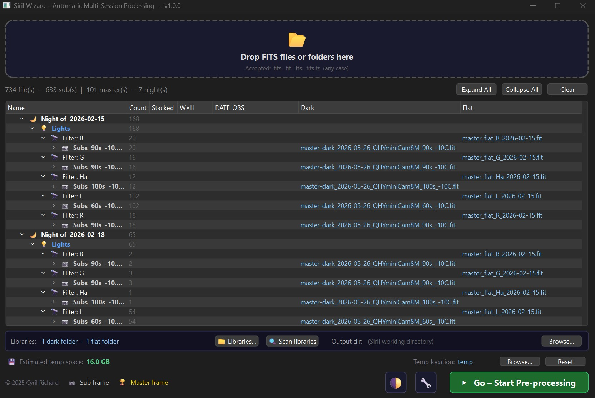
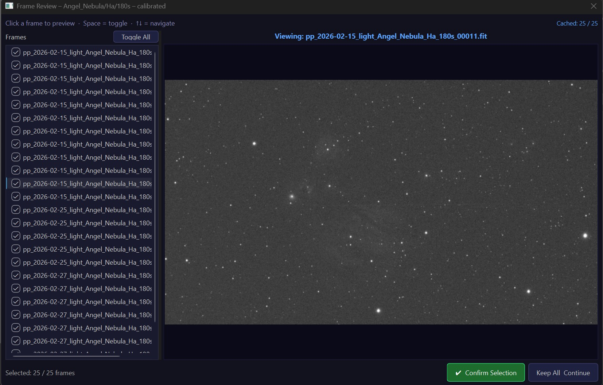
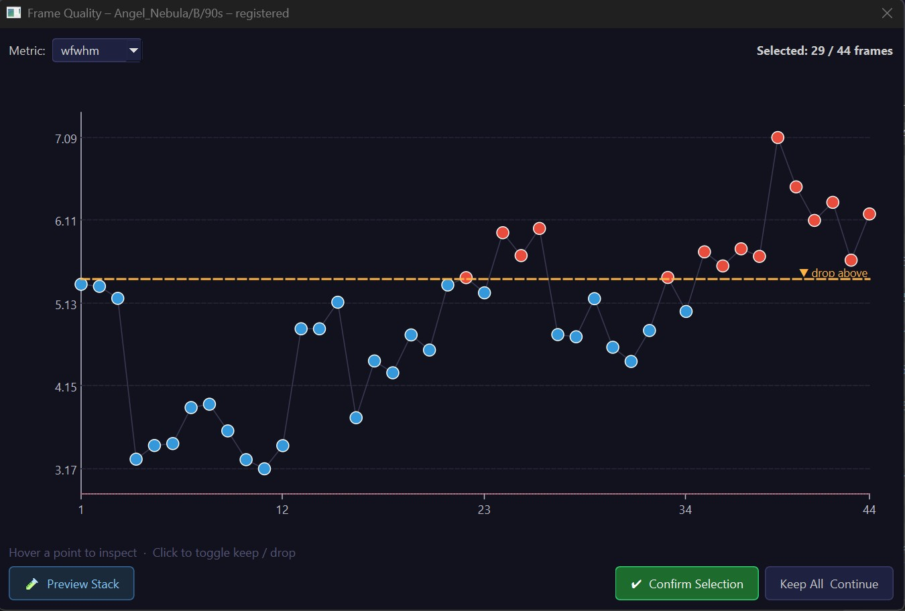
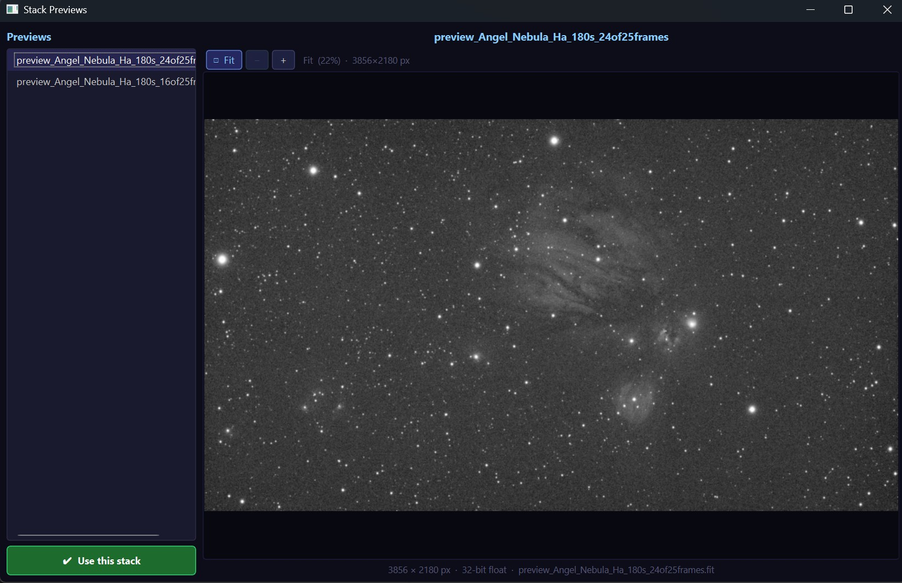

# Siril Wizard – Automatic Multi-Session Processing Plus (AMSP Plus)

AMSP Plus is a Siril Python script that automates calibration and stacking across multiple imaging sessions. This is based on the AMSP.py script developed for Siril, but with many features added on top to make stacking more accessible, and add more useful tools for more advanced usage.  Drop in your FITS files — sorted or not — and it groups them by object, session, filter, and exposure time, matches them against calibration masters, and runs the full pipeline through to a final stacked image per target.

This document covers the core workflow: building calibration masters (both from a shared library and from files dropped in for a single run), matching those masters to your light frames, the pipeline options, and the two interactive review tools available during processing.

## Basic usage

Drag FITS files or folders onto the drop zone. AMSP reads each file's header (`IMAGETYP`, `FILTER`, `EXPTIME`, `DATE-OBS`, and related keywords) and builds a tree showing what it found: lights grouped by target and observing night, calibration sub-frames grouped by type, and any master frames already present. The "night" boundary is noon-to-noon, so a session that runs past midnight stays grouped together.

Files prefixed with BAD_ (like ones from Nina) can optionally be removed when found.

Master-frame detection doesn't rely on the filename alone. A file is treated as a master if its name contains the word "master", or if its `STACKCNT` header is greater than 1, or if its `LIVETIME` exceeds its `EXPTIME` — so a folder mixing raw subs and finished masters sorts correctly without any manual tagging.

Once your files are loaded and calibration is matched (see below), click **▶ Go – Start Pre-processing**. The pipeline runs four phases: registering calibration masters into place, calibrating each session's lights, registering and stacking all sessions of a filter together, and finally aligning multiple stacks of the same target if more than one exists.

Note that AMSP itself no longer stacks raw bias/dark/flat sub-frames as part of this run — that step happens ahead of time, using the library or local stacking tools described next. If un-stacked calibration subs are still sitting in your file list when you click Go, or if some light groups have no matching master at all, AMSP warns you before starting and lets you go back and fix it or continue anyway.

## Building calibration masters

There are two distinct ways to get from raw calibration sub-frames to finished masters, and they serve different purposes.

### Master library stacking

This is for calibration frames you want to reuse across many imaging sessions and projects — a folder of darks taken over time at a given exposure and temperature, or flats you retake periodically. Click **📁 Libraries…** to configure one or more folders for dark masters and one or more for flat masters (these are independent: darks and flats can each have several search locations). AMSP scans these folders recursively whenever needed.

Click **🔍 Scan libraries** at any time to check your configured folders for sub-frames that haven't been stacked into masters yet. If it finds any, the **Build Master Calibration Frames** wizard opens. This same scan also runs automatically right after you drop new files, in case those files included calibration subs.

The wizard groups what it finds into a sequence of steps, unlocking one at a time as you complete or skip the previous one:

- **Bias** (shown only if very short darks — sub-0.01s exposures — are present): stacked first since the result is needed as a bias source for the steps that follow.
- **Darks**: grouped by camera, exposure time, and temperature, with date-based clustering so darks taken within a few days of each other combine into one stack. Each group shows the bias it will be calibrated against, if one is available.
- **Flats**: grouped by camera, filter, telescope/focal length, and single observing night (flats are never combined across nights). Each row shows whether it found a matching **dark flat** (a dark whose exposure time closely matches the flat's, used in place of bias for cameras where that's more accurate) or falls back to a plain bias.

Each step has its own checklist of stacks to build, a Stack button, and a Skip button — you don't have to build everything in one pass. Masters are written into `<library folder>/<YYYY-MM-DD>/master-*.fit`, dated by the session they came from, so future runs and future scans find them automatically. There's also an optional "delete source sub-frames after stacking" checkbox at the bottom if you want the library to self-clean as it grows.

If you drop calibration sub-frames into AMSP directly (rather than already having them in a library folder) and you do have library folders configured, AMSP offers to copy them into your library first via a **Copy Calibration Subs to Library** dialog, so they become part of the long-term collection rather than being processed once and discarded. A caution banner reminds uncooled DSLR users that dark current varies enough with temperature that mixing library darks across nights isn't recommended for that camera type — process each night's calibration together instead in that case.

### Local (this-run) stacking

If you don't want to build a library, or library matching genuinely doesn't apply (no library folder configured at all), AMSP instead offers to stack the calibration sub-frames you just dropped into temporary masters used only for this run. This uses the same step-by-step wizard interface as library stacking, but with tighter matching tolerances (exposure time to 0.01s, temperature to 0.1°C) since everything comes from a single drop rather than a sprawling collection, and the resulting masters are written into a private temp folder rather than a library path.

These locally-stacked masters appear in the file tree under their own **🧪 This Run – Locally Stacked Masters** section, distinct from anything pulled from a library, so you can always tell what's permanent and what's scoped to the current session. They're automatically cleaned up once processing finishes or the file list is cleared.

## Matching masters to light frame groups

However your masters were produced — library, local stacking, or simply dropped in directly as finished files — they still need to be paired with the right light frame groups before the lights can be calibrated. Click the **🌓** button (tooltip: "Assign master flats to sessions") to open the **Calibration Master Assignments** window.

This window has two tabs:

**Flats** lists every (session, filter) combination found among your lights. Rows with an exact same-night master flat are marked ✓ and locked in automatically. Other rows are auto-matched using the closest-by-date flat — first checking up to 14 days *before* the session, then up to 14 days after — and marked ⚡ if a confident match was found or ⚠ if only a more distant match exists. Every row still has an editable dropdown, so any assignment (even a ✓ exact match) can be overridden manually. A checkbox at the top, "Allow cross-session flat matching," controls whether this nearest-date fallback is used at all; turning it off means sessions without a same-night flat get no flat correction.

**Darks** lists every unique combination of camera, filter, exposure, and temperature found in your lights, and shows the dark master AMSP would use for each, pulled from local-run masters first, then loaded master files, then your external dark library. A mode selector at the top of this tab switches the matching strategy:

- **By session** matches lights to whatever dark was stacked for that same observing night, falling back to the closest exposure-time match in the library if nothing exists for that exact night.
- **By camera / exposure / temperature** ignores session date entirely and instead matches on camera ID, exposure time (within 20%), and set temperature (within 1°C) — useful when your darks and lights weren't necessarily shot the same night but you trust they're still valid matches.

If the best-matching dark for a row is more than a year old relative to the session being calibrated, that row is flagged in amber with a tooltip explaining the risk (dark current drifts as sensors age), so you're not silently calibrating with a stale dark.

Saving this dialog stores your choices for the run; you can reopen it any time before clicking Go to review or adjust them. If you skip it entirely, AMSP still computes its own best-guess assignments automatically in the background the moment your files finish scanning, so the tree's Dark and Flat columns are populated even if you never open the matcher — opening it later just shows you those same recommendations, pre-filled, ready to confirm or change.

## Pipeline options

The **🔧** button opens the options dialog, which covers several independent settings:

- **Background extraction** runs Siril's background subtraction on each calibrated sequence before registration.
- **Distortion correction** plate-solves the reference frame and applies the resulting WCS distortion model during registration; this needs a solver configured in Siril.
- **Interactive frame review** turns on the thumbnail viewer and quality graph described below. With it off, the pipeline runs fully unattended.
- **Drizzle integration** enables Drizzle (or Bayer Drizzle for color sensors) during registration instead of standard interpolation, with adjustable scale and pixfrac.
- **Flat Calibration** settings control the dark-flat match tolerance (how many seconds below a flat's own exposure time a dark is still allowed to count as a "dark flat" substitute — matching always rounds down, since a longer dark would over-subtract the flat) and which calibration source is preferred when both a bias and a matching dark flat are available.
- **Synthetic Bias** lets you supply a Siril expression (for example `=10*$OFFSET`) instead of using a master bias file at all, for setups where no bias subs exist.
- **Thumbnail Acceleration** controls whether the frame review thumbnails use PyTorch (GPU when available, otherwise CPU tensors) and whether to render them at higher resolution and bit depth.
- **Temporary Files** shows how much orphaned temp data AMSP has left behind from previous runs (in case something crashed) and lets you clear it.

## The sequence reviewer

When **Interactive frame review** is on, AMSP pauses twice per filter group during processing: once right after calibration, and once after registration.

The first pause shows a **thumbnail viewer** — every calibrated frame, auto-stretched and rendered as a thumbnail, with a checklist you can use to deselect anything that looks bad before it goes into registration. Thumbnails load progressively in the background while you browse, with the frame nearest wherever you're currently looking prioritized first. Arrow keys step through frames and Space toggles the current one; there's also a "Toggle All" shortcut and a "Keep All & Continue" button if nothing needs removing.

## The quality graph tool

The second pause, after registration, shows an interactive **quality graph** plotting one metric at a time — wFWHM, roundness, or median — across every frame in the sequence. Points are colored by current keep/drop state, and clicking a point toggles it directly. You can also drag a threshold line down from the top of the graph to drop every frame above a value, or drag one up from the bottom to drop everything below a value; each metric keeps its own independent pair of thresholds, and moving a line back toward its edge re-selects whatever it passes over.

From this same window you can click **🧪 Preview Stack** to build a temporary stack from whatever's currently selected, without committing to it. The result opens in a separate, non-blocking **Stack Previews** window with a zoomable, pannable, full-resolution view (not just a thumbnail) of each preview you've generated, so you can compare different selection thresholds side by side before deciding. If one of those previews is the one you actually want, clicking **✔ Use this stack** there copies it into the final output and skips re-stacking — otherwise, confirming your selection back in the graph window proceeds straight to the normal final stack using whatever frames are currently selected.

